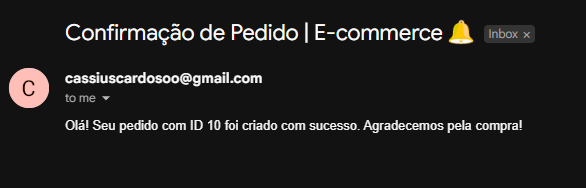
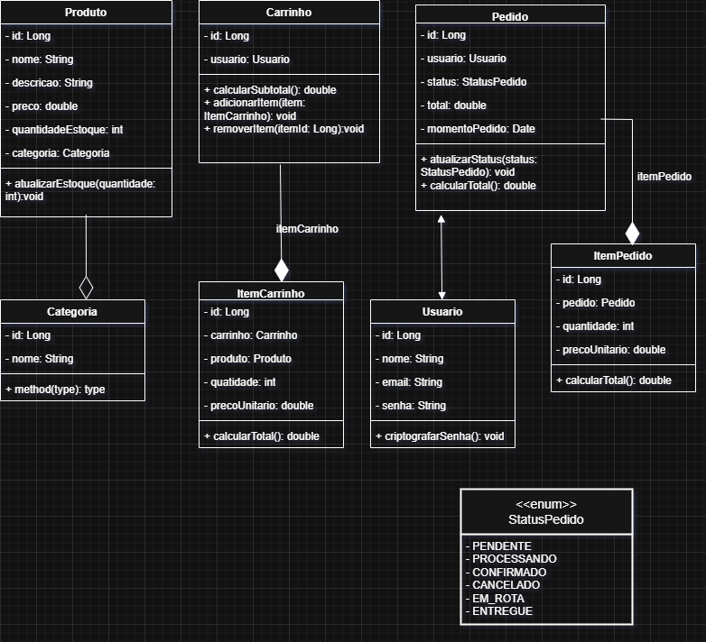
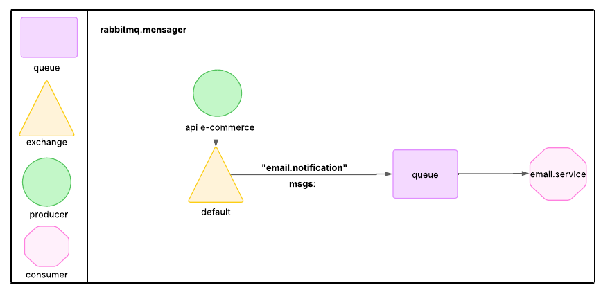

# Gerenciamento de Pedidos - E-commerce

API RESTful para gerenciamento de pedidos em um e-commerce, com suporte a usuários, produtos, carrinhos, pedidos e notificações por e-mail via RabbitMQ.

## Tecnologias Utilizadas

- Spring Boot (Java 17)
- Spring Security
- PostgreSQL
- RabbitMQ
- Docker e Docker Compose
- Swagger (OpenAPI)

## Pré-requisitos

- Java 17
- Maven
- Docker e Docker Compose
- Conta de e-mail SMTP (ex.: Gmail, com senha de aplicativo)

## Configuração e Execução

### Opção de utilizar via Docker Hub ou construir localmente via GitHub com a url do repositório conforme a explicação um pouco mais abaixo.
A imagem da aplicação está disponível de forma pública no Docker Hub. Faça o passo abaixo para utilizar o Docker compose e rodar corretamente.
- **Puxar a imagem**
```bash
   docker pull cassiusss/e-commerce:v1.0
```g
1. **Clonar o Repositório | Construir localmente**
<code> 
git clone <URL_DO_REPOSITORIO>
cd gerenciamento-pedidos <code>

2. **Configurar o Arquivo `application.yml`**
   Edite `src/main/resources/application.yml` para configurar o e-mail SMTP.
<details>
<summary>Verificar arquivo</summary>
spring:
mail:
host: smtp.gmail.com
port: 587
username: seu-email@gmail.com
password: sua-senha-de-app
properties:
mail:
smtp:
auth: true
starttls:
enable: true
</details>

**Nota**: Gere uma senha de aplicativo no Gmail em `myaccount.google.com/security` com 2FA ativado.

3. **Configurar o Docker Compose**
   Certifique-se de que `compose.yaml` está na raiz do projeto.
<details>
<summary>Verificar arquivo</summary>

services:
db:
image: postgres:15
environment:
POSTGRES_DB: ecommerce
POSTGRES_USER: admin
POSTGRES_PASSWORD: secret
ports:

"5432:5432" volumes:
pgdata:/var/lib/postgresql/data healthcheck: test: ["CMD-SHELL", "pg_isready -U admin -d ecommerce"] interval: 10s timeout: 5s retries: 5 networks:
app-network rabbitmq: image: rabbitmq:3-management ports:
"5672:5672"
"15672:15672" healthcheck: test: ["CMD", "rabbitmq-diagnostics", "-q", "ping"] interval: 10s timeout: 5s retries: 5 networks:
app-network app: build: context: . dockerfile: Dockerfile ports:
"8080:8080" depends_on: db: condition: service_healthy rabbitmq: condition: service_healthy environment:
SPRING_PROFILES_ACTIVE=docker networks:
app-network command: ["sh", "-c", "sleep 15 && java -jar app.jar"] volumes: pgdata: networks: app-network: driver: bridge

</details>

4. **Criar o `Dockerfile`**
   Crie um arquivo `Dockerfile` na raiz do projeto.
<details>
<summary>Verificar arquivo</summary>
FROM maven:3.8.5-openjdk-17 AS build
WORKDIR /app
COPY pom.xml .
RUN mvn dependency:go-offline
COPY src ./src
RUN mvn package -DskipTests
FROM openjdk:17-jdk-slim
WORKDIR /app
COPY --from=build /app/target/*.jar app.jar
EXPOSE 8080
CMD ["java", "-jar", "app.jar"]
</details>

5. **Iniciar o Ambiente**
<code> docker-compose up --build -d </code>

- PostgreSQL: `localhost:5432` (usuário: `admin`, senha: `secret`, banco: `ecommerce`)
- RabbitMQ: `localhost:5672` (usuário: `guest`, senha: `guest`, painel: `http://localhost:15672`)
- Aplicação: `http://localhost:8080`

6. **Acessar a Documentação Swagger**
   Acesse `http://localhost:8080/swagger-ui.html` para explorar os endpoints.

### Configuração do Arquivo `.env`

Crie um arquivo `.env` na raiz do projeto com as seguintes variáveis:

```env
# PostgreSQL
POSTGRES_USER=admin
POSTGRES_PASSWORD=your_secure_password
DB_DATABASE=ecommerce

# RabbitMQ
RABBITMQ_USERNAME=guest
RABBITMQ_PASSWORD=guest

# Spring Mail (SMTP)
MAIL_USERNAME=your_email@gmail.com
MAIL_PASSWORD=your_app_password

# Spring Security
SECURITY_USERNAME=admin
SECURITY_PASSWORD=your_secure_security_password

## Imagens complementares


## Diagramas
Diagrama ER


Diagrama Mensageria 



## Endpoints

Use Swagger, Postman ou cURL na seguinte ordem:
1. Criar um usuário (`POST /usuario`).
2. Criar um produto (`POST /produto`).
3. Criar um pedido (`POST /pedido`) ou usar o carrinho (`POST /carrinho/{id}/itens`, `POST /carrinho/checkout`).

## Verificação Inicial

- **API**: Teste `GET /usuario` no Swagger (status `200`).
- **RabbitMQ**: Acesse `http://localhost:15672` (login: `guest/guest`) e cheque a fila `pedido-criado-queue`.
- **E-mail**: Após um pedido, verifique o e-mail enviado (use MailHog ou caixa de entrada).
